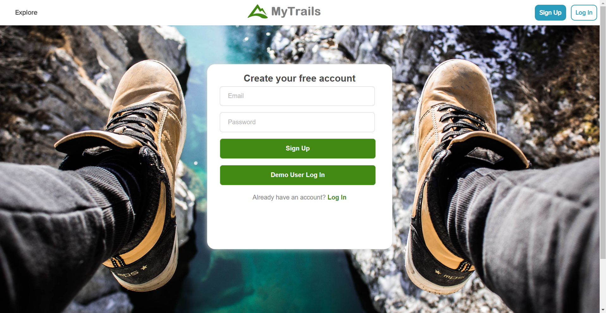
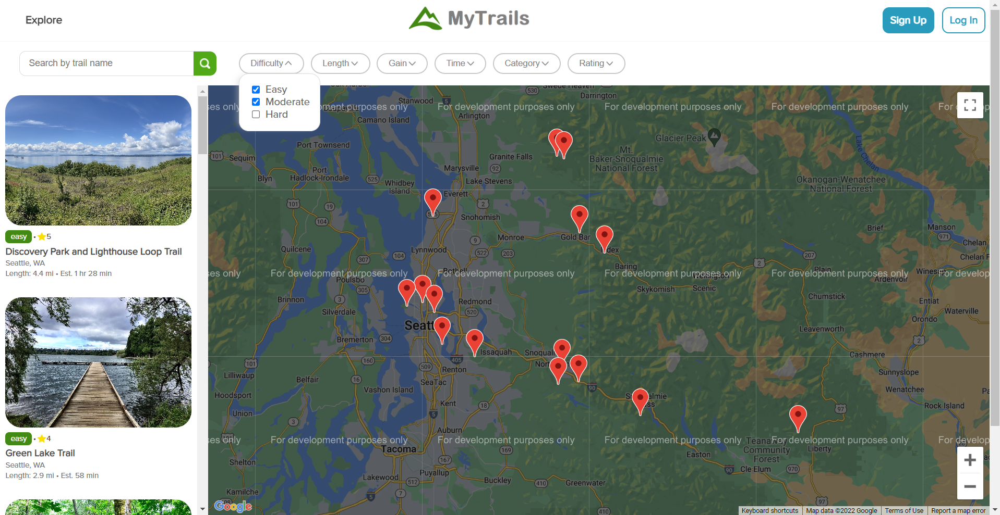
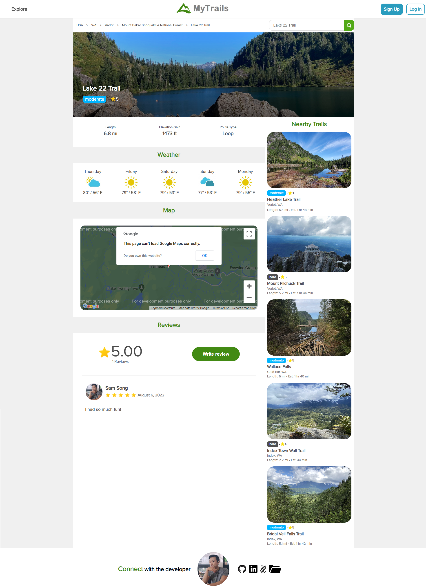
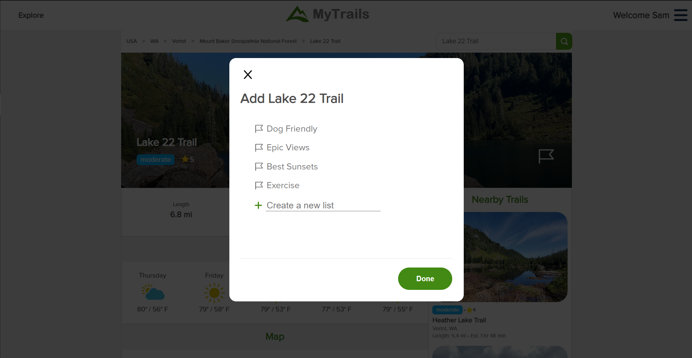
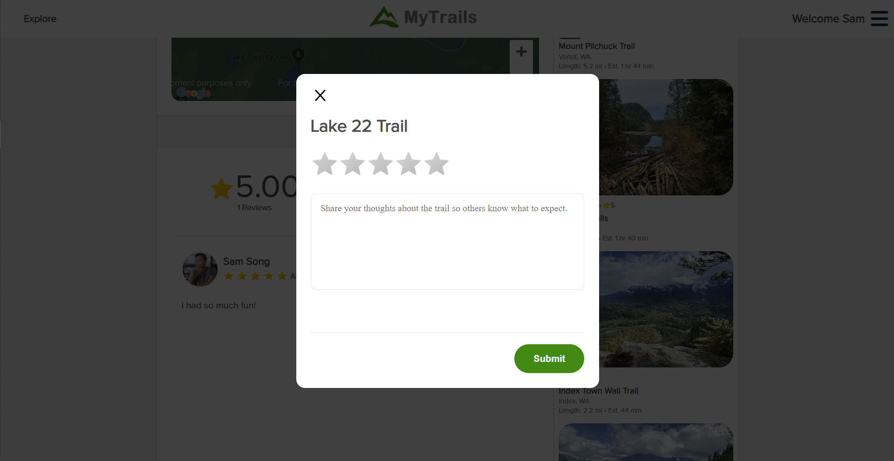
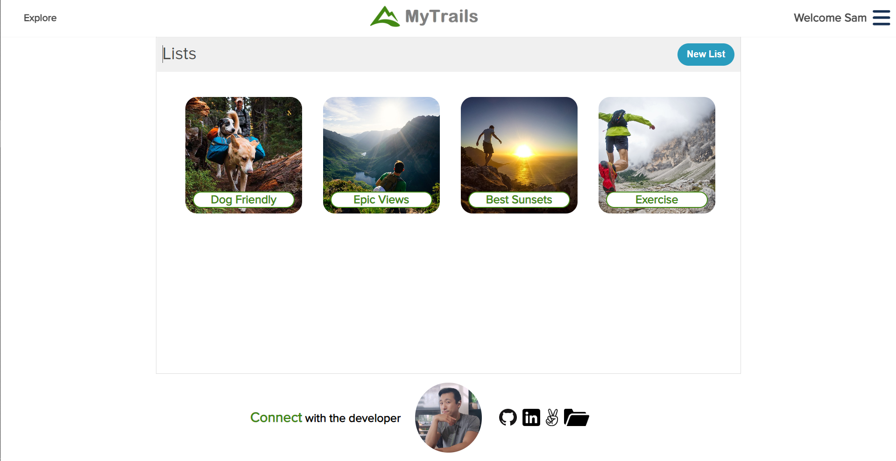
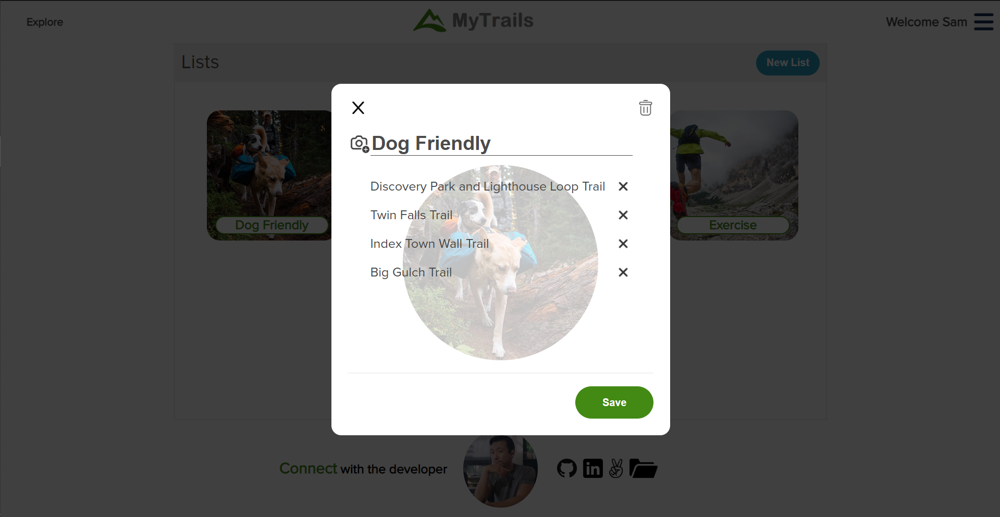

# [MyTrails](https://hike-my-trails.herokuapp.com)

In MyTrails 🌳🏃‍♂️ users can search through a map 🌎 or search bar to find hiking trails 🌄 in their area. They can view details of any trail in the database 🖥 which includes length, elevation 📐, 5-day weather forecast ☔, map location, user reviews ⭐ and nearby trails. Users can sign up for a free account to rate and write reviews 📝 for trails, create custom lists of their favorite trails and fill out their profile 🙌.

## ⚡ Languages & Technologies
Languages: HTML, CSS, JavaScript, Ruby
 
Backend: Ruby on Rails, PostgreSQL, jBuilder, AWS S3
 
Frontend: React, Redux, AJAX
 
Hosting: Heroku

## ⚙️ Functionalities
- 🚦 User Authentication
    - Users can create an account and login to their profile
- ⛳ Goals CRUD
    - Users can create goals and subgoals
- 😀 Daily Reaction Tracker CRUD
    - Users can record their emotion to each one of their goals once a day
- 🤝 User can be paired with another user to be their anonymous accountability partner
    - Users are paired based on their goal category: habit forming or breaking
- 💬 Live Chat CRUD
    - Users can live chat with their partner in a private chatroom about their goal
    - Users can also unmatch with a partner and be matched with another random user

