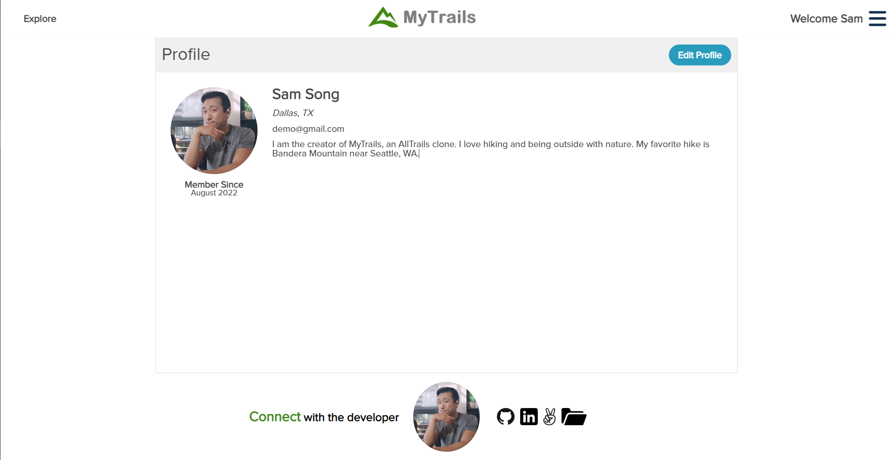

# [MyTrails](https://hike-my-trails.herokuapp.com)

In MyTrails 🌳🏃‍♂️ users can search through a map 🌎 or search bar to find hiking trails 🌄 in their area. They can view details of any trail in the database 🖥 which includes length, elevation 📐, 5-day weather forecast ☔, map location, user reviews ⭐ and nearby trails. Users can sign up for a free account to rate and write reviews 📝 for trails, create custom lists of their favorite trails and fill out their profile 🙌.

## ⚡ Languages & Technologies
Languages: HTML, CSS, JavaScript, Ruby
 
Backend: Ruby on Rails, PostgreSQL, jBuilder, AWS S3
 
Frontend: React, Redux, AJAX, GoogleMaps API, OpenWeatherMap, API
 
Hosting: Heroku

## ⚙️ Functionalities
- 👨‍🦱 User Profile CRUD
    - Users can create an account and login to their profile
    - Logged in users can fill in and edit their personal information
- ⭐ Reviews CRUD
    - Logged in users can rate a trail from 0-5 stars and write a review
- ❤️ Favorite Lists CRUD
    - Logged in users can create custom lists and add or delete trails from them
- 🔎 Search bar
    - Users can type in the search bar to look up trails
    - Auto suggestions based on user input
- 🌍 Explore map
    - Users can explore an interactive map displaying trails with markers
    - Filters for difficulty, length, gain, time, category, and rating populate the map with markers
- ⛺ Trails CRUD
    - Trail page displays average rating, basic trail info, weather forecast, map location, reviews, and the most nearby trails
    - Logged in users can add a trail and write a review directly from a trail page
- 🌦 Weather Forecast
    - Displays a 5 day weather forecast of any trail locale with image representation and high/low temperatures
- 📷 Upload Images
    - Logged in users can upload a profile photo and photos for their custom lists to be stored on AWS S3

